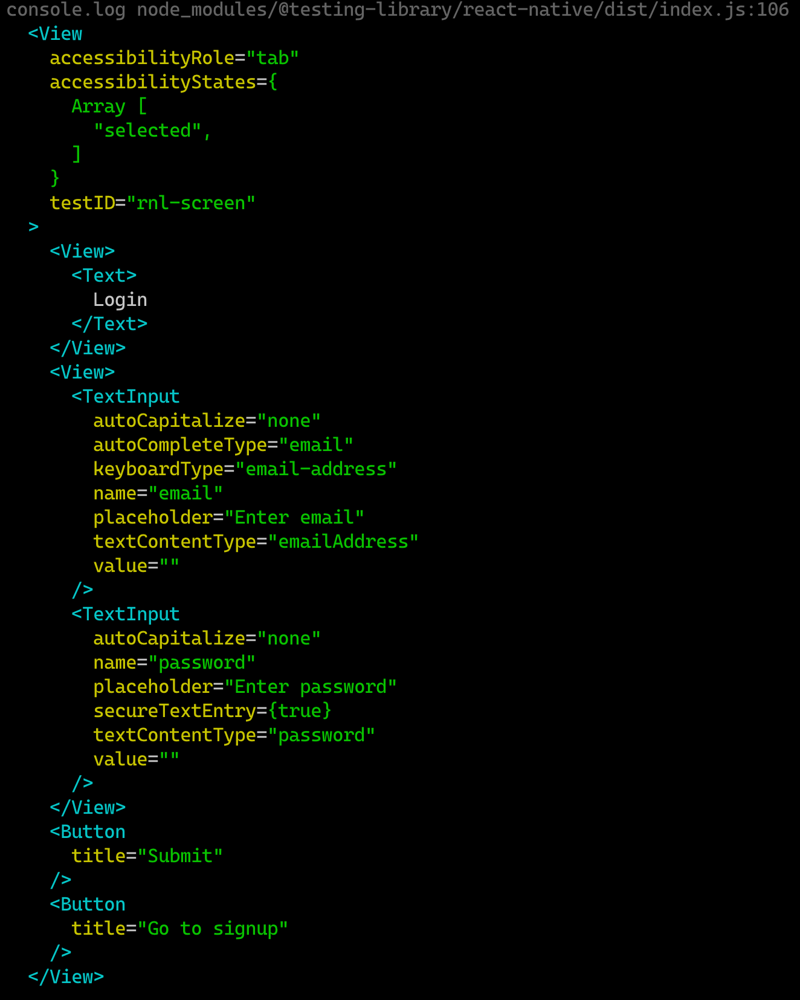

In this section, we will configure our test environment and run tests on the form that we just implemented.

## Installation

```bash
yarn add --dev @testing-library/react-native @testing-library/jest-native navigation-test-utils

# if you're running typescript you'll need these as well
yarn add --dev @types/jest @types/react-native typescript ts-jest
```

## Configuring typescript

If you're running typescript and do not already have a `tsconfig.json`, you'll want to add one at the root of your project:

```json
{
  "compilerOptions": {
    "target": "es5",
    "module": "commonjs",
    "jsx": "react",
    "strict": true,
    "noImplicitAny": false,
    "esModuleInterop": true
  }
}
```

## Configuring the test environment

There's some addition configuration to get everything running - we can do this in `package.json`:

```json
  // ...
  "jest": {
    "preset": "@testing-library/react-native",
    "transformIgnorePatterns": [
      "node_modules/(?!(react-native|react-native-screens|react-native-reanimated)/)"
    ],
    "setupFilesAfterEnv": [
      "@testing-library/react-native/cleanup-after-each",
      "navigation-components/mock",
      "navigation-test-utils/cleanup-after-each"
    ],
    "transform": {
      "^.+\\.(t)sx?$": "ts-jest"
    }
  }
```

**Note:** the `transform` key here is only to be used for typescript projects.

Here's a brief breakdown of each of this fields:

- `preset`: `@testing-library/react-native` loads a bunch of mocks and stuff to simulate React Native. Our tests will run in this simulated environment

- `transformIgnorePatterns`: some dependencies aren't transpiled to older javascript, so we specify that babel should transpile them before running our tests. If you're running a project with a lot of dependencies, it's likely you'll have to add more to this list as lots of RN packages do not transpile their code before shipping to npm

- `setupFilesAfterEnv`: these files will run before each test file - here we are cleaning up the environment after each test, and mocking out some components that are used by navigation-components but don't work in a test environment

- `transform`: we're specifying all of our `.tsx` files to run through ts-jest

## Writing our first test

Let's make sure everything is working and move on to some real tests.

**Note:** If you're coming from a fresh install of React Native, there have been issues in the past of running the included test (`__tests__/App-test.js`) so you might want to remove this first.

Create a file `__tests__/login-form.test.tsx` and include the following boilerplate

```tsx
import React from 'react';
import { render } from 'navigation-test-utils';
import LoginForms from '../login-form';

test('render()', () => {
  const { getFocused } = render(<LoginForms />);]

  getFocused().debug()
});
```

You'll notice we pulled in `render` from the `navigation-test-utils` package. Under the hood this uses `@testing-library/react-native`. If you're not familiar with the `testing-library` apis, you can check out the docs for the native one here: https://www.native-testing-library.com/.

`navigation-test-utils` returns a `getFocused()` method when we render a navigator. This function works in tandem with `navigation-components` to return the currently focused view of your components, making tests much easier to debug and work with.

Now run the test:

```bash
yarn test --watch
```

and you should see something in your terminal that looks like this:



You can peek into your components at any point in a test using getFocused, which can help a lot when you're trying to figure out what's going on:

```tsx
import { fireEvent } from '@testing-library/react-native'

test('render()', () => {
  const { getFocused } = render(<LoginForms />);]

  getFocused().debug()

  // navigate to signup screen
  fireEvent.press(getFocused().getByText(/to signup/i))

  // outputs signup screen
  getFocused().debug()
});
```

Now that we have our test environment working, we can start making some assertions. Let's write some tests!

```tsx
test('login', async () => {
  const inputData = {
    email: 'andy@test.ca',
    password: '123456',
    type: 'login',
  };

  const { getFocused } = render(<LoginForms />);

  // assert success screen is not focused
  expect(() => getFocused().getByText(/success/i)).toThrow();

  // we need to wrap the changeText events in an async act() because formik updates values asynchronously
  await act(async () => {
    fireEvent.changeText(
      getFocused().getByPlaceholderText(/email/i),
      inputData.email
    );

    fireEvent.changeText(
      getFocused().getByPlaceholderText(/password/i),
      inputData.password
    );

    fireEvent.press(getFocused().getByTitle('Submit'));
  });

  getFocused().getByText(/success/i);
});

test('signup', async () => {
  const inputData = {
    name: 'andy',
    email: 'andy@test.ca',
    password: '123456',
    type: 'signup',
  };

  const { getFocused } = render(<LoginForms />);

  fireEvent.press(getFocused().getByText(/to signup/i));

  await act(async () => {
    const signupScreen = getFocused();

    fireEvent.changeText(
      signupScreen.getByPlaceholderText(/name/i),
      inputData.name
    );

    fireEvent.changeText(
      signupScreen.getByPlaceholderText(/email/i),
      inputData.email
    );

    fireEvent.changeText(
      signupScreen.getByPlaceholderText(/password/i),
      inputData.password
    );

    // fireEvent.press(getFocused().getByTitle('Submit'));
  });

  getFocused().getByText(/success/i);
});
```

You'll notice that the second test fails because we never hit the submit button. Uncomment that section of the test and all test should be green.

## Adding a submit call

One thing we're missing in our tests is confirmation that the input data is actually being submitted. Let's add those calls to LoginForms and test it out.

```tsx
// login-forms.tsx

function LoginForms({onSubmit}: any) {
  const navigate = useNavigate()

  function handleSubmit(data: iFormValues) {
    navigate('success-modal')
    onSubmit(data)
  }

  ...

}
```

```tsx
// __tests__/login-form.test.tsx
test('login', async () => {
  const inputData = {
    email: 'andy@test.ca',
    password: '123456',
    type: 'login',
  };

  const fakeSubmit = jest.fn();

  const { getFocused } = render(<LoginForms onSubmit={fakeSubmit} />);

  // assert success screen is not focused
  expect(() => getFocused().getByText(/success/i)).toThrow();

  // we need to wrap the changeText events in an act() because formik updates values asynchronously
  await act(async () => {
    fireEvent.changeText(
      getFocused().getByPlaceholderText(/email/i),
      inputData.email
    );

    fireEvent.changeText(
      getFocused().getByPlaceholderText(/password/i),
      inputData.password
    );

    expect(fakeSubmit).not.toHaveBeenCalled();

    fireEvent.press(getFocused().getByTitle('Submit'));
  });

  // verify submit call receives input data
  expect(fakeSubmit).toHaveBeenCalledWith(expect.objectContaining(inputData));

  getFocused().getByText(/success/i);
});
```

Try implementing the same thing for your signup test and see how it goes! We've now successfully captured the core functionality of our login forms.

## Summary

- in order to get up and running with jest, there are a few required dependencies you need to install, and some configuration that you can setup in your `package.json`. Projects using typescript need to install some additional dependencies, and add a `tsconfig.json` to the project

- we can render our navigators using the `render` function from `navigation-test-utils`, which returns a `getFocused()` method for targeting the focused screen in our tests. This method can be run at any step in your test to help you see what is going on in your markup and run assertions on what the user would be seeing.

- `@testing-library/react-native` is an excellent resource for all of the other tools we can use in our tests: https://www.native-testing-library.com/
